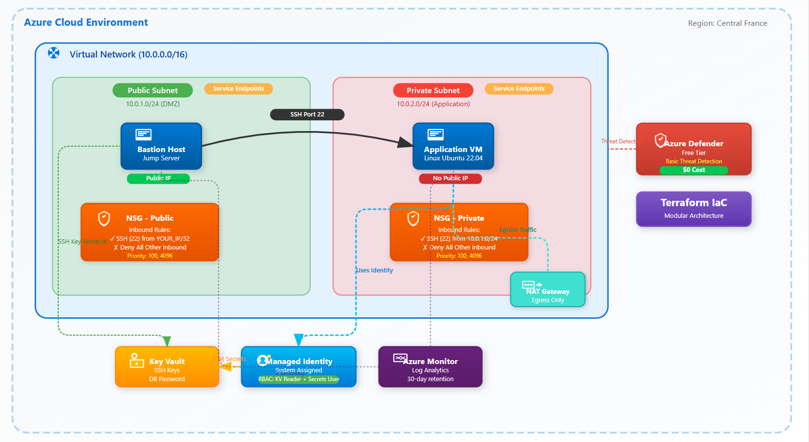

# Terraform Secure Infra Lab
## Project Overview

This project implements a secure, cost-optimized Azure infrastructure using Terraform Infrastructure as Code (IaC). The architecture follows Azure
Well-Architected Framework principles with emphasis on security (defense-in-depth) and cost optimization for development/testing environments.

### Architecture Components

- **Virtual Network**: Segmented into public DMZ and private application subnets
- **Compute**: Bastion host (jump server) in public subnet, application VM in private subnet
- **Security**: Network Security Groups with restrictive rules, managed identities, Key Vault for secrets
- **Monitoring**: Azure Monitor agents and Log Analytics integration
- **Cost Controls**: Auto-shutdown schedules, Basic/Standard SKU selection, free tier optimization

## Technical Architecture

```
Azure Subscription
└── Resource Group (rg-terraform-securelab)
    ├── Virtual Network (10.0.0.0/16)
    │   ├── Public Subnet (10.0.1.0/24)
    │   │   ├── Bastion VM (with Public IP)
    │   │   └── NSG (Allow SSH from admin IP only)
    │   └── Private Subnet (10.0.2.0/24)
    │       ├── Application VM (no public IP)
    │       └── NSG (Allow SSH from public subnet only)
    ├── Key Vault
    │   ├── SSH Private Key
    │   └── Database Password Secret
    └── Managed Identities (System-assigned for VMs)
```
## Module Structure

### Root Module Configuration

**Files:**
- `main.tf` - Module orchestration and resource dependencies
- `variables.tf` - Input variable definitions
- `outputs.tf` - Output values for module interconnection
- `providers.tf` - Azure provider configuration
- `terraform.tfvars` - Variable values (gitignored)

**Key Implementations:**
```hcl
# Random suffix for globally unique names
resource "random_string" "suffix" {
  length  = 6
  special = false
  upper   = false
}

# Module dependency chain
# network -> compute -> keyvault -> security
```


-------------------------------------------------------------------------------------------------------------------------
### Root Module Configuration

**Files:**

- `main.tf` - Module orchestration and resource dependencies
- `variables.tf` - Input variable definitions
- `outputs.tf` - Output values for module interconnection
- `providers.tf` - Azure provider configuration
- `terraform.tfvars` - Variable values (gitignored)

**Key Implementations:**

```hcl
# Random suffix for globally unique names
resource "random_string" "suffix" {
  length  = 6
  special = false
  upper   = false
}

# Module dependency chain
# network -> compute -> keyvault -> security
```


-------------------------------------------------------------------------------------------------------------------------
**Compute Overview**

The compute module provisions compute resources for the Secure Cloud Infra project.
It includes:

Bastion VM in the public subnet (for secure SSH/RDP access).
Private VM in the private subnet (no public IP, accessible only via Bastion).
System-assigned Managed Identities enabled for both VMs.

**Inputs**

| Name | Type	| Description	| Example |
| --- | --- | --- | --- |
resource_group | string	| The name of the resource group where VMs live	| rg-terraform-securelab
location | string	| Azure region for resources | westeurope
public_subnet_id | string	| ID of the public subnet for the bastion VM	| -
private_subnet_id	| string	| ID of the private subnet for the private VM | -

**Outputs**

| Name | Description | Example |
| --- | --- | --- |
bastion_vm_ip	| Public IP of the Bastion VM | 20.16.122.210
bastion_vm_principal_id | Principal ID of Bastion VM’s managed identity	| 11111111-2222-3333-4444-555555555555
private_vm_principal_id | Principal ID of Private VM’s managed identity | 66666666-7777-8888-9999-000000000000

**Purpose:** Deploys hardened Linux VMs with security configurations

**Resources Created:**

- TLS private key (4096-bit RSA)
- Public IP (Standard SKU due to Basic limitations)
- Network interfaces with NSG associations
- Bastion VM (Ubuntu 22.04 LTS)
- Private VM (Ubuntu 22.04 LTS)
- Azure Monitor extensions
- Auto-shutdown schedules (7 PM UTC)

**Security Hardening Implementation:**

Used cloud-config for reliable package installation:

```yaml
#cloud-config
packages:
  - ufw
  - fail2ban
  - unattended-upgrades
runcmd:
  - Configure firewall rules
  - Enable fail2ban
  - Harden SSH configuration
  - Install Azure CLI from Microsoft repository
```

**Additional Notes**

Bastion VM is the secure entry point — no direct access is allowed to the private VM.
Both VMs use Managed Identities, assigned access to Key Vault or later to other Azure resources.
Private VM has no public IP to minimize attack surface.

------------------------------------------------------------------------------------------------------------------------
### Key Vault Module
**Purpose:** Centralized secrets management

**Resources Created:**

- Azure Key Vault (Standard SKU)
- Access policies for user and VMs
- Diagnostic settings for audit logging

**Configuration:**

```hcl
purge_protection_enabled = false  # For dev/test environments
soft_delete_retention_days = 7
enable_rbac_authorization = false  # Using access policies

secret_permissions = ["Get", "List", "Set", "Delete", "Purge", "Recover"]
```
-------------------------------------------------------------------------------------------------------------------------

### Security Module

**Purpose:** Implements RBAC and secret storage

**Resources Created:**

- Key Vault secrets (database password)
- Access policies for VM managed identities

**RBAC Implementation:**

- Private VM: Get permission only for secrets
- Principle of least privilege enforced

-------------------------------------------------------------------------------------------------------------------------
### Network Module

**Purpose:** Establishes network foundation with security boundaries

**Resources Created:**

- Virtual Network (10.0.0.0/16)
- Public Subnet (10.0.1.0/24) with service endpoints
- Private Subnet (10.0.2.0/24) with service endpoints
- Network Security Groups with rules
- NSG-to-subnet associations

**Security Rules Implemented:**

**Public Subnet NSG:**

```
Inbound:
  - Allow SSH (22) from admin_source_ip only (Priority: 100)
  - Deny all other inbound (Priority: 4096)
Outbound:
  - Allow HTTPS (443)
  - Allow HTTP (80)
  - Allow DNS (53)
  - Allow SSH to private subnet
```

**Private Subnet NSG:**

```
Inbound:
  - Allow SSH from VirtualNetwork (Priority: 200)
  - Deny all other inbound (Priority: 4096)
Outbound:
  - Allow HTTPS/HTTP/DNS for updates
```

-------------------------------------------------------------------------------------------------------------------------
## Security Measures Implemented

1. **Network Segmentation**: Public/private subnet isolation
2. **Bastion Host Pattern**: Single hardened entry point
3. **NSG Rules**: Explicit deny-all with specific allows
4. **No Public IPs**: Private resources have no direct internet exposure
5. **Managed Identities**: No hardcoded credentials
6. **SSH Key Authentication**: Password authentication disabled
7. **Automated Security Updates**: Unattended-upgrades configured
8. **Fail2ban**: Brute force protection
9. **UFW Firewall**: Host-level protection
10. **Audit Logging**: Key Vault access logging

## Cost Optimizations

- **VM SKU**: Standard_B1s (eligible for free tier - 750 hours/month)
- **Storage**: Standard_LRS (lower cost than Premium)
- **Public IP**: Standard SKU (Basic had limitations)
- **Auto-shutdown**: 7 PM UTC daily
- **Monitoring**: Free tier limits respected

**Estimated Monthly Cost**: ~$15-20 (with auto-shutdown enabled)